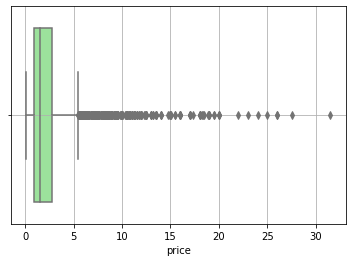
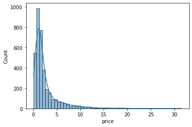
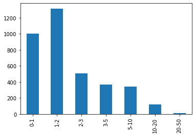
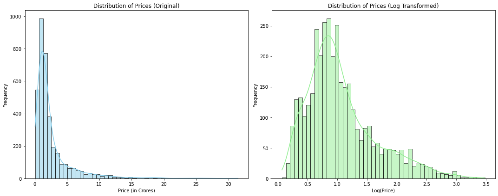
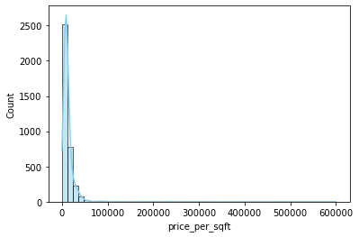
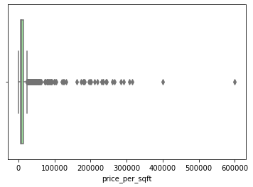

# House Price Prediction 

# House Price Prediction App

## Project Summary
The House Price Prediction App is designed to scrape real estate data from [99acres.com](https://www.99acres.com) and utilize machine learning techniques to predict house prices accurately for the city gurgaon. The captured data is stored in Google Drive, ensuring accessibility and scalability. The project follows a structured ML pipeline where data ingestion are efficiently managed. The entire process, including the storage of artifacts, is systematically maintained within the project.

## Initial Setup
To set up and run the project, follow these steps:

## Univariate EDA Observations.
### Property type
- Flats are in majority(75 percent) and there are less number of houses(~25 percent)
- No missing values

### Society
- Around 13% properties comes under independent tag.
- There are 675 societies. 
- The top 75 societies have 50 percent of the preperties and the rest 50 percent of the properties come 
under the remaining 600 societies
    - Very High (>100): Only 1 society has more than 100 listings.
    - High (50-100): 2 societies have between 50 to 100 listings.
    - Average (10-49): 92 societies fall in this range with 10 to 49 listings each.
    - Low (2-9): 273 societies have between 2 to 9 listings.
    - Very Low (1): A significant number, 308 societies, have only 1 listing.
- 1 missing value

### Sectors
- There are a total of 104 unique sectors in the dataset.

- Frequency distribution of sectors:
    - Very High (>100): 3 sectors have more than 100 listings.
    - High (50-100): 25 sectors have between 50 to 100 listings.
    - Average (10-49): A majority, 60 sectors, fall in this range with 10 to 49 listings each.
    - Low (2-9): 16 sectors have between 2 to 9 listings.
    - Very Low (1): Interestingly, there are no sectors with only 1 listing.

### Price
- Descriptive Statistics:
    - Count: There are 3,660 non-missing price entries.
    - Mean Price: The average price is approximately 2.53 crores.
    - Median Price: The median (or 50th percentile) price is 1.52 crores.
    - Standard Deviation: The prices have a standard deviation of 2.98, indicating variability in the prices.
    - Range: Prices range from a minimum of 0.07 crores to a maximum of 31.5 crores.
    - IQR: The interquartile range (difference between 75th and 25th percentile) is from 0.95 crores to 2.75 crores.

- Visualizations:
    - Distribution: The histogram indicates that most properties are priced in the lower range (below 5 crores), with a few properties going beyond 10 crores.
    - Box Plot: The box plot showcases the spread of the data and potential outliers. Properties priced above approximately 10 crores might be considered outliers as they lie beyond the upper whisker of the box plot.

- Missing Values: There are 17 
 

**Skewness**: The price distribution has a skewness of approximately 3.28, indicating a positive skew. This means that the distribution tail is skewed to the right, which aligns with our observation from the histogram where most properties have prices on the lower end with a few high-priced properties.

**Kurtosis**: The kurtosis value is approximately 14.93. A kurtosis value greater than 3 indicates a distribution with heavier tails and more outliers compared to a normal distribution.

Quantile Analysis:
    - 1% Quantile: Only 1% of properties are priced below 0.25 crores.
    - 5% Quantile: 5% of properties are priced below 0.37 crores.
    - 95% Quantile: 95% of properties are priced below 8.5 crores.
    - 99% Quantile: 99% of properties are priced below 15.26 crores, indicating that very few properties are priced above this value.

Outliers Analysis (using IQR method):
    - Based on the IQR method, there are 425 properties considered as outliers.
    - These outliers have an average price of approximately 9.24 crores.
    - The range for these outliers is from 5.46 crores to 31.5 crores.
    - The majority of properties are priced in the "1-2 crores" and "2-3 crores" ranges.
    - There's a significant drop in the number of properties priced above "5 crores."'
    


np.log1p(x): This function computes the natural logarithm of 1+x. 
It's designed to provide more accurate results for values of x that are very close to zero.

Using np.log1p helps in transforming the price column while ensuring that any value (including zero, if present) is handled appropriately. When we need to reverse the transformation, we can use np.expm1 which computes e^x-1


### Price per sqft.:- Most properties have a price_per_sqft ranging between approximately ₹0 and ₹40,000. There is a significant concentration in the lower range, with a few properties having exceptionally high price_per_sqft.

The box plot clearly shows several outliers, especially on the higher side. The interquartile range (IQR) is relatively compact, but there are many data points beyond the "whiskers" of the box plot, indicating potential outliers

    

#### Observations
    - Potential Outliers
    - Right Skewed
    - 17 missing values

### Prerequisites
- Python (>= 3.8)
- pip package manager
- Required Python libraries

### Steps to Setup

1. **Create a Virtual Environment**
   ```sh
   python -m venv venv
   source venv/bin/activate 
   
   On Windows use: venv\Scripts\activate
   ```

2. **Install Dependencies**
   ```sh
   pip install -r requirements.txt
   ```
3. **Test Environment**
   ```sh
   python testEnvironment.py
   ```

4. **Run Pipeline**
   ```sh
   python runPipeline.py
   ```